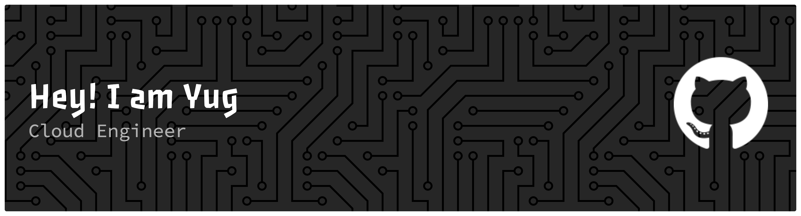

<!--  -->

##  Hello! Myself Yug and I'm Grad Student based in San Jose, CA

Passionate Fullstack Software Engineer with hands-on experience in developing scalable, responsive, and accessible applications across front-end and back-end systems. alongside expertise in cloud platforms like AWS, GCP, and Azure. Skilled in building scalable and responsive applications using technologies like Next.js, Node.js, Golang, and Java, with strong Object-Oriented Programming.
<!--  -->

##  Tech Stack

<!--  -->

### Primary Tech Stack

    

   

### Databases
    

### Cloud & DevOps

     

##  Connect with Me

    

<!-- 

 -->

##  GitHub Stats

<!-- Made with [OSS Insight](https://ossinsight.io/) -->
<!-- <a href="https://next.ossinsight.io/widgets/official/compose-user-dashboard-stats?user_id=48444630" target="_blank" style="display: block" align="center">
  <picture>
    <source media="(prefers-color-scheme: dark)" srcset="https://next.ossinsight.io/widgets/official/compose-user-dashboard-stats/thumbnail.png?user_id=48444630&image_size=auto&color_scheme=dark" width="771" height="auto">
    
  </picture>
</a> -->

 
  <!--  -->
  
  

 

<!--  -->

<!-- <picture>
  <source media="(prefers-color-scheme: dark)" srcset="/../output/github-snake-dark.svg" />
  <source media="(prefers-color-scheme: light)" srcset="/../output/github-snake.svg" />
  
</picture> -->
